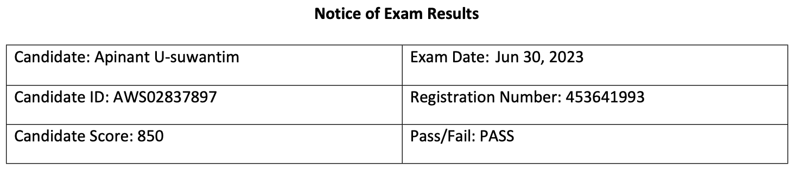

The CLF-C01: AWS Certified Cloud Practitioner Exam is the first step to becoming
AWS Certified. It's a foundational exam that tests your understanding of the AWS
Cloud, making it suitable for anyone looking to familiarize themselves with AWS
Cloud.

For readers visiting this blog from the future, please note that CLF-C01 exam,
will be replaced by the CLF-C02 exam. From my perspective, if you're aiming for
a 100% score like I did, there isn't much difference between the two versions.
If you come across a mock exam for the old version, don't hesitate to use it for
practice.

Here the comparison table from
[AWS website](https://aws.amazon.com/certification/certified-cloud-practitioner/).

| Domain                  | [CLF-C01](https://d1.awsstatic.com/training-and-certification/docs-cloud-practitioner/AWS-Certified-Cloud-Practitioner_Exam-Guide.pdf) | [CLF-C02](https://d1.awsstatic.com/training-and-certification/docs-cloud-practitioner/AWS-Certified-Cloud-Practitioner_Exam-Guide_C02.pdf) |
| ----------------------- | -------------------------------------------------------------------------------------------------------------------------------------- | ------------------------------------------------------------------------------------------------------------------------------------------ |
| Cloud Concepts          | 26%                                                                                                                                    | 24%                                                                                                                                        |
| Security and Compliance | 25%                                                                                                                                    | 30%                                                                                                                                        |
| Technology              | 33%                                                                                                                                    | 34%                                                                                                                                        |
| Billing and Pricing     | 16%                                                                                                                                    | 12%                                                                                                                                        |

## Background

I have been working with AWS Cloud at a surface level in my recent role as a
Software Engineer. However, I've never really dived deep into it since it wasn't
part of my job responsibilities. Consequently, my experience with AWS Cloud is
quite limited.

Should you take this exam? Absolutely, yes! I highly recommend it. It's an
excellent starting point for getting familiar with cloud platforms. This isn't
exclusive to AWS - you could also explore other cloud platforms like
[Azure](https://azure.microsoft.com/en-us) or [GCP](https://cloud.google.com/).

Doing so will help you understand the bigger picture of how cloud technology
works and how it can transform your future work.

For instance, in the past, I was tasked with extracting data from large PDF
files, splitting them, uploading the pieces to
[AWS S3](https://aws.amazon.com/s3/), and converting the data into database
records. This process involved AWS [Batch](https://aws.amazon.com/batch/) and
[Lambda](https://aws.amazon.com/lambda/). However, at the time, I had no idea
what those services were.

I simply treated S3 as regular file storage and Batch and Lambda as standard
servers. Looking back, I realize I had many questions: Why use Lambda and Batch?
Can Lambda work independently? Why not use
[EC2 RI or Spot instances](https://aws.amazon.com/ec2/instance-types/)? Another
point of frustration was that during planning and design sessions with my team,
we never really discussed best practices for cloud platforms.

However, I want to stress that understanding cloud technology is important as it
can help solve problems in more efficient and effective ways.

Have I convinced you yet? If so... **Let's get started!!**

## Preparation and Resources

### Day 1 - 2: Absorb as Much Information as Possible

I spent the first few hours of the first day researching the exam. I needed to
understand the exam format, the number of questions, the time limit, the passing
score, and other relevant details. Afterward, I dedicated the rest of the day to
studying for the exam. Here are the resources I used:

- AWS Cloud Documentation

While some people might prefer
[the official AWS Cloud Documentation](https://explore.skillbuilder.aws/learn/course/external/view/elearning/134/aws-cloud-practitioner-essentials),
which is comprehensive and detailed, I favor physical books because reading
online tends to strain my eyes. However, if you're comfortable with online
reading, the AWS Cloud Documentation is an excellent resource, and it even
includes a mock exam at the end.

- Video Courses

[The official AWS Cloud video course](https://explore.skillbuilder.aws/) is a
great starting point. It's free and updated regularly. YouTube is another
platform with a wealth of content. I recommend watching videos at 1.5x or even
2x speed to save time, if you can keep up. However, I chose to use Udemy for my
studies. YouTube has good content, but it's not as well-organized, and the
videos I liked tended to cram a lot of information into long, 14-16 hour videos.
It was hard for me to commit to watching these lengthy videos.

- Other Resources

I found flashcards to be an effective learning tool that utilizes time
efficiently. You can use them while waiting for food, riding a bus, or even
during a bathroom break. You'd be surprised at how much you can learn in short
bursts of time. Anki and Quizlet are great platforms for finding useful
flashcards.

### Day 3-5: Practice with Mock Exams

I had about 10 mock exams at my disposal. Three were from the official AWS
Cloud, and the rest I purchased from Udemy for around 10 dollars, which included
6 tests. I believe it was a worthwhile investment.

My study approach was to take a mock exam, review the questions I got wrong and
understand why, then retake the test before moving on to the next one. I
repeated this process for each exam. I managed to take 3-4 mock exams per day,
and I found this method to be very effective.

## Exam Day

I took the exam at home via Pearson VUE's online proctoring because the closest
test center was too far from my place. To take the exam, you need a reliable
internet connection, a webcam, and a microphone.

I checked in 30 minutes before the exam. The entire check-in process took around
15 minutes, but then I had to wait in a queue for another 30 minutes before the
proctor showed up. During this waiting time, I couldn't leave my spot.

One mistake I made was drinking coffee before the exam, which increased my
anxiety during the test. However, the overall process was straightforward and
easy to follow with the provided instructions.

> **Tip:** If you're a non-native English speaker like me, I recommend
> requesting an exam accommodation to get an extra 30 minutes.

## Results and Conclusion

I was expecting a score of around 900+ because I was confident about my
preparation, but I ended up with a score of 850 from 1000. Still, a pass is a
pass!

My approach to preparing for the exam was to focus on understanding the concepts
that made sense to me. I didn't want to over-focus on AWS because the main goal
was to become familiar with cloud platforms and how they work, not to memorize
every detail.

I hope this blog post will help you get started with AWS Cloud. If you have any
questions, feel free to leave a comment below. I'll do my best to answer them.

For those of you preparing to take the exam, good luck and have fun!

---

**Validation Number**: `VQP8C9F1XBB414WH`

**Validate at**:
[https://aws.amazon.com/verification](https://aws.amazon.com/verification)

**Badge**:
[Credly](https://www.credly.com/badges/adb67daa-9fa7-4ad4-8854-49f6693152ce/public_url)
