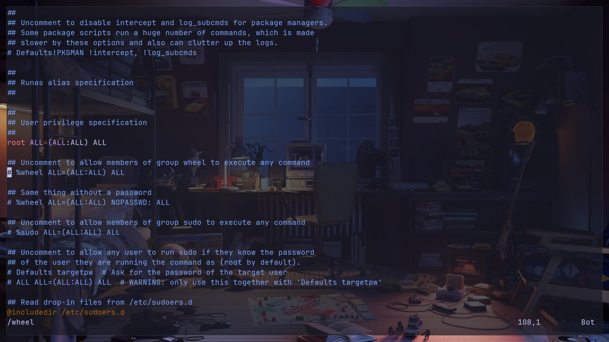

In my recent job, I was forced to use Windows (Yeah, I know). So, I needed to find a way to use a Unix-based distro. Some distros are available in the Windows store, but I wanted to use Arch, which is not officially maintained. So, I started digging into how to do that myself.

In this article, I will walk you through step how to use any Docker (or container) image as WSL (Windows Subsystem for Linux), not only Arch but other distros as well. Let's focus on container images available in the Docker Hub.

First things first, we need Docker to pull our base image. I'm going to install Ubuntu and install Docker in WSL.

I find this method cleaner than installing Docker Desktop. We can delete this WSL later.

Let's assume you have WSL installed and ensure it's the latest version by running `wsl --update`.


After that, install Ubuntu with the WSL command `wsl --install -d ubuntu` or another Ubuntu variant by listing available distros using the command `wsl --list --online`.


After finishing installing Ubuntu, you will be prompted to register a username and password.

Next, we will install Docker with the script from [Docker Install GitHub Repository](https://github.com/docker/docker-install). This can take a couple of minutes.

```sh
curl -fsSL https://get.docker.com -o get-docker.sh
sh get-docker.sh
```


After Docker is installed, run the post-install script so we can run Docker without typing `sudo`.

[Docker Post-Install Documentation](https://docs.docker.com/engine/install/linux-postinstall/)


Let's test by running the `hello-world` image. It should work like this picture:

Now, we can pull Arch Linux and then export it to a tar file so we can use it with WSL.

```sh
docker run -it --name arch archlinux sh -c "exit"
docker export arch > /tmp/arch.tar
```


Navigate to `\\wsl.localhost\Ubuntu-24.04\tmp` to see the `arch.tar` file we exported.


Create a directory where you want to store WSL. Mine is `C:\Users\LoneExile\WSL`.


Now we can import it.

```sh
wsl --import arch-demo C:\Users\<YOUR_USER>\WSL\arch-demo\ \\wsl.localhost\Ubuntu-24.04\tmp\arch.tar
```


```sh
wsl --list
```

You can see it in the list now 🎉


Before we start using it, we need to initialize the pacman keyring.

```sh
wsl -d arch-demo
```

The command `pacman-key --init` in Arch Linux is used to initialize the pacman keyring. The keyring is a collection of cryptographic keys used by `pacman`, the package manager in Arch Linux, to verify the integrity and authenticity of packages.

```sh
pacman-key --init
```


Next, add the username and password that you want to use. Mine is `le`.

```sh
useradd -m -G wheel le
passwd le
pacman -Syyu # update package
pacman -Syu sudo vim git curl # install packages
EDITOR=vim visudo
```


Then uncomment this line `%wheel ALL=(ALL:ALL) ALL`.

This line allows all users in the `wheel` group to execute any command as any user or group using `sudo`.



Now we can exit and then log in to the user we created.


Now edit this file `/etc/wsl.conf`.

* `systemd=true`: This setting enables the use of `systemd` as the init system for your WSL distribution.
* `generateResolvConf = false`: This setting prevents WSL from automatically generating the `resolv.conf` file.
* `default=<YOUR_USER>`: This setting specifies the default user that will be logged in when you start a WSL session.

```sh
sudo vim /etc/wsl.conf
```

```sh
[boot]
systemd=true

[network]
generateResolvConf = false

[user]
default=<YOUR_USER>
```


Then shut down your WSL.

Edit the `.wslconfig` file at `C:\Users\<YOUR_USER>\.wslconfig`. ([Reference](https://learn.microsoft.com/en-us/windows/wsl/wsl-config#example-wslconfig-file))

```sh
# Settings apply across all Linux distros running on WSL 2
[wsl2]

# Limits VM memory to use no more than 4 GB, this can be set as whole numbers using GB or MB
memory=32GB

# Sets amount of swap storage space to 8GB, default is 25% of available RAM
swap=8GB
```


Log back into the Arch Linux WSL with the command `wsl ~ -d archlinux -u le`.

Installing `archlinux-keyring` is important to ensure that your system can verify and trust the packages and updates you download from the Arch Linux repositories.

Test install with the `neofetch` package:

```sh
sudo pacman -S archlinux-keyring
sudo pacman -S neofetch
```


What if we want a GUI application? Let's try!

```sh
pacman -Syu gimp
```


If it doesn't work, here is the fix:

<https://superuser.com/questions/1617298/wsl-2-running-ubuntu-x-server-cant-open-display/1834709#1834709>

```sh
rmdir /tmp/.X11-unix && ln -s /mnt/wslg/.X11-unix /tmp/.X11-unix
```

Then run it again.


But you need to run that command every time WSL restarts. We can automate it with `systemd`.

```sh
sudo vim /etc/systemd/system/wslg.service
```

```sh
[Unit]
Description=symlink /tmp/.X11-unix
After=systemd-tmpfiles-setup.service

[Service]
Type=oneshot
ExecStart=rmdir /tmp/.X11-unix
ExecStart=ln -s /mnt/wslg/.X11-unix /tmp/

[Install]
WantedBy=sysinit.target
```


```sh
systemctl enable wslg
```

We can link Windows commands to launch applications in Arch Linux as well. Here, I link `explorer.exe` to Arch Linux as `open`.

```sh
sudo ln -s "/mnt/c/Windows/explorer.exe" "/usr/local/bin/open"
```


Finally, I can use my [Neovim](https://github.com/LoneExile/nvim) and start working now 🚀


If you have any questions, please leave a comment below.
